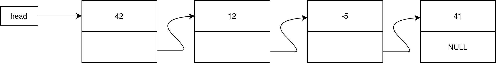
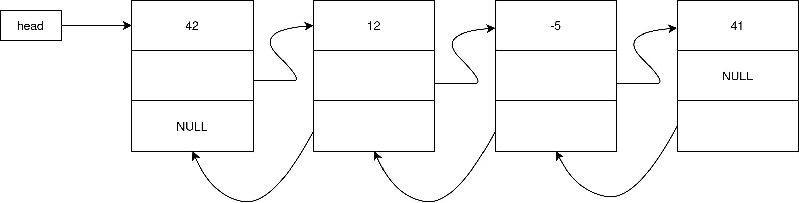

# Structures dynamiques

Une structure dynamique est une structure (type `struct`)
contenant un ou plusieurs champs de données (nombres, 
chaînes, etc.) et un ou plusieurs champs qui sont des
pointeurs vers d'autre structure du même type.

Ceci permet de représenter, par example, des listes, des
arbres, des graphes, etc.

## Exemple : les listes chaînées

Voici la définition d'un élément de la liste (qu'on appelle
un nœud (_node_)). Le typedef permet juste de nommer le
type _node_ au lieu de _struct node_ par la suite.

~~~~C
typedef struct node node;
struct node {
   int val;
   node *next;
};
~~~~

Pour accéder à la valeur d'un champ à partir d'un
pointeur _p_ vers une telle structure, on pourrait
utiliser la notation : `(*p).val` (et non pas 
`*p.val` qui tenterait de déréférencer `val` !).

Comme cette notation n'est pas très commode on a un
raccourci _(sucre syntaxique)_ : `p->val`.

Chaque élément est alloué en mémoire dynamiquement 
(_malloc_) lors de sa création. Si un élément doit
être supprimé il est important de libérer la mémoire
(_free_).

_val_ est la valeur stocké dans un nœud, _next_ est un
pointeur vers l'élément suivant de la liste. Pour le
dernier élément ce pointeur vaut _NULL_.

C'est d'une façon similaire que les listes sont représentées
derrière la scène dans des langages comme Python.

Une liste chaînée est représentée par un pointeur vers
son premier élément : _head_ (tête).

Que vaut _head_ pour une liste vide ? Réponse : _NULL_

Étudiez le source de `intlist.c`.

Pourquoi la fonction `append_val` qui ajoute un élément
à la fin d'une liste doit renvoyer un pointeur vers son
premier élément ? 

Écrivez des fonctions renvoyant :

- `int length(node *head)` : la longueur d'une liste chaînée
- `int min(node *head)` : le plus petit nombre dans une liste
- `int max(node *head)` : le plus grand nombre dans une liste
- `int sum(node *head)` : la somme des nombres d'une liste

`length` et `sum` doivent fonctionner même sur une liste vide,
en revanche `min` et `max` peuvent supposer que la liste
contient au moins un élément.

Écrivez une fonction `node *insert(node *head, val)` qui
_insère_ un élément au _début_ d'une liste.

Pourquoi cette fonction doit-elle renvoyer un pointeur
vers _node_ ?

Écrivez une fonction `node *remove_val(node *head, val)`
qui _supprime_ le premier élément de la liste contenant la valeur _val_
(si il existe).

Pourquoi cette fonction doit-elle renvoyer un pointeur
vers _node_ ?

Dernier problème : écrire une fonction qui renvoie une liste
à l'envers : `node *reverse_list(*node head)` en tirant profit de la fonction
`insert_val`.

## Des pointeurs vers des pointeurs ?

Beaucoup de nos fonctions doivent traiter des cas particulier
quand head vaut NULL (liste vide) ou quand l'élément à traiter
est en début de liste.

Pour éviter ce cas particulier on peut utiliser des pointeurs
vers un pointeur. 

Toutes les fonctions écrites précédemment deviennent beaucoup
plus élégante mais plus subtiles à écrire !

## Autres structures classiques 

Liste doublement chaînées, permettent d'avancer et reculer
facilement dans la liste :

~~~~C
typedef struct node node;
struct node {
    int val;
    node *prev;
    node *next;
}
~~~~

Arbres binaires :

~~~~C
typedef struct node node
struct node {
    int val;
    node *left;
    node *right;
}
~~~~

etc. etc.

